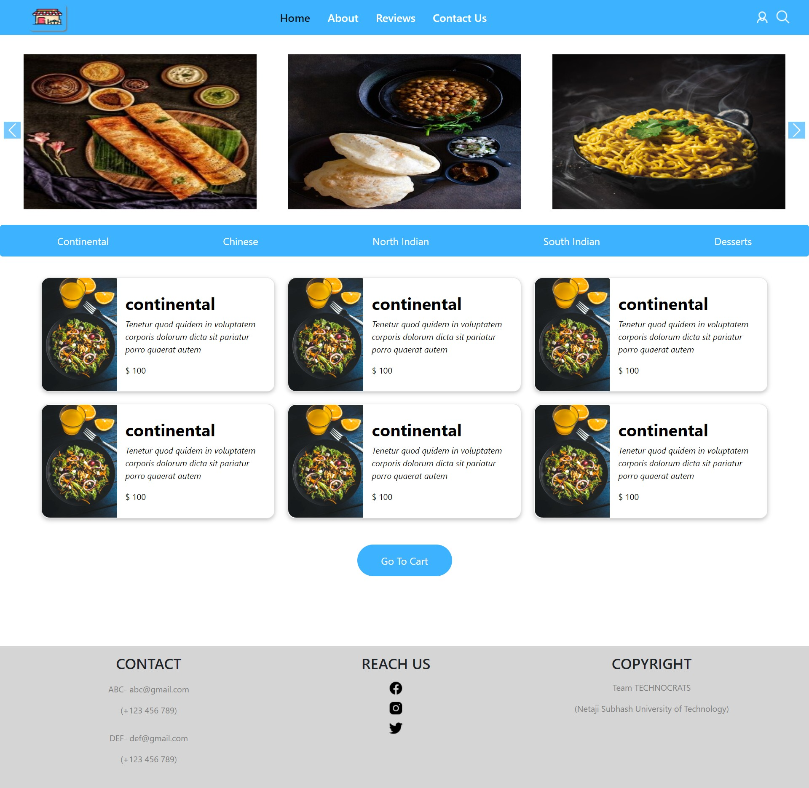
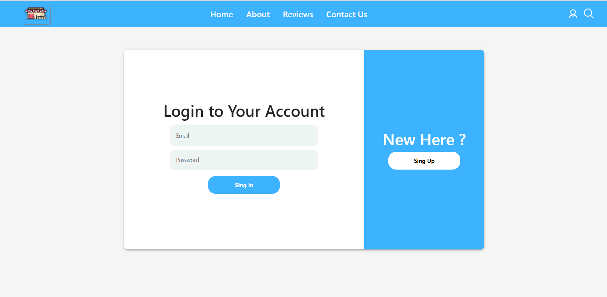
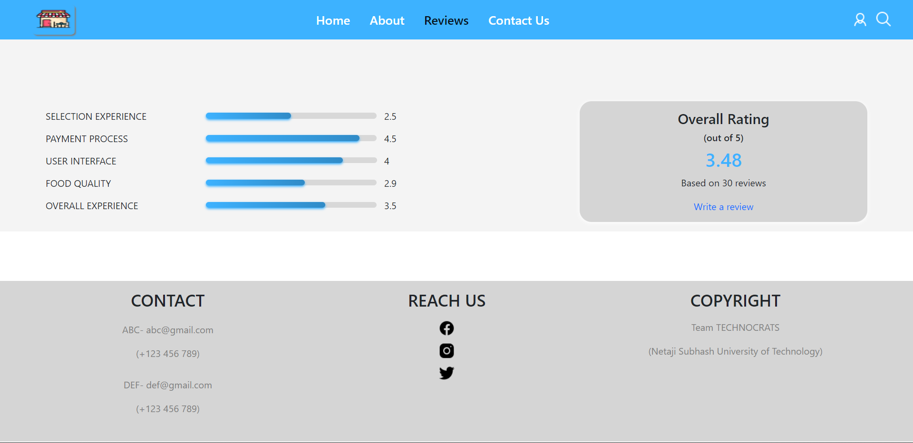
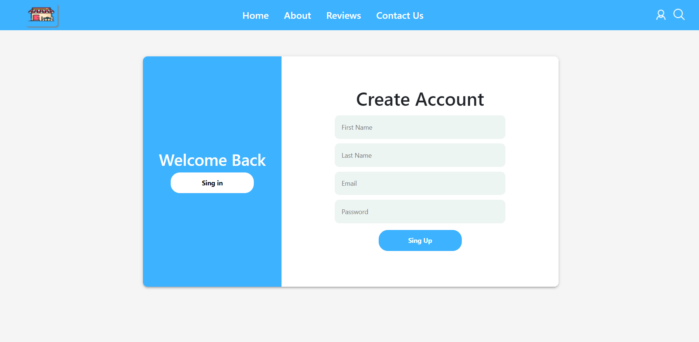
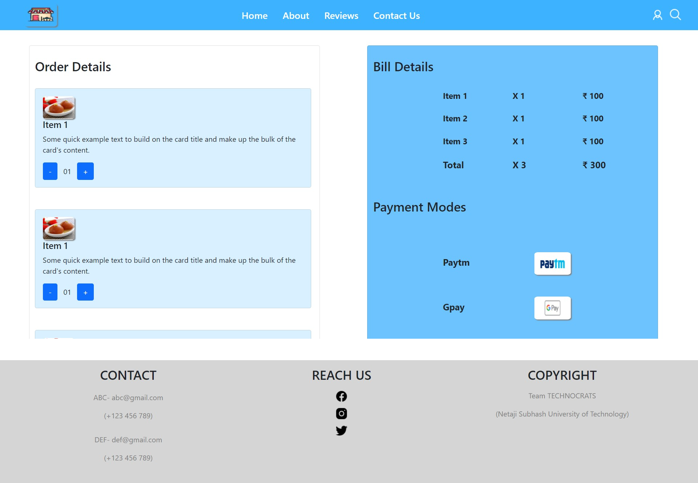

  

<h1 align="center">Restaurant Website</h1>

  
  
  
  
  

  
  
  
  
  

# About

The main purpose is also to prevent the spread of COVID-19. This online food ordering application simplifies the ordering process for the various stakeholders involved in it, also reducing the crowd at the counters.

---

We have made an online food ordering service where people sitting in the restaurant can place their order easily without going to the counter thereby decreasing the crowd and it is easy to use.

Customer can place order after selecting the food item they want to eat from the menu.
The menu has various categories like continental, chinese and any more.

---
<h3 align="left">Technologies Used:</h3>

 
 
 
 
 

 

The tool can be accessed from the WebApp repository, by installing the requirements and launching `Aapp.js`.

---

## Methodology

Our aim is to make the work of employees easier using this the customer can directly interact with the backend by placing order and the employee need not to hard code the information given by the customer.

---

## Upcoming Features
* Functional Login and Signup
* Customers can add the food items in the cart 
* Customers can give their valuabe reviews regarding any food item

---

## How to use it ?

In the project directory, you can run:

### `npm i`
This will add all the necessary files such as node modules which you will require while running the project.

### `npm start`

This will runs the app in the development mode.\
Open [http://localhost:3000](http://localhost:3000) to view it in the browser.

The page will reload if you make edits.\
You will also see any lint errors in the console.

## How to Contribute to Restaurant-App?

- Take a look at the Existing [Issues](*) or create your own Issues!
- Wait for the Issue to be assigned to you.
- Fork the repository
- Have a look at [Contibuting Guidelines](*)

---

#### [Welcome to Restaurant-App Discussions !](*)

---

### 🌟 Contributors

### Credit goes to these brilliant people ✨✨:

<table>
	<tr>
		<td>
			
		</td>
	</tr>
</table>

